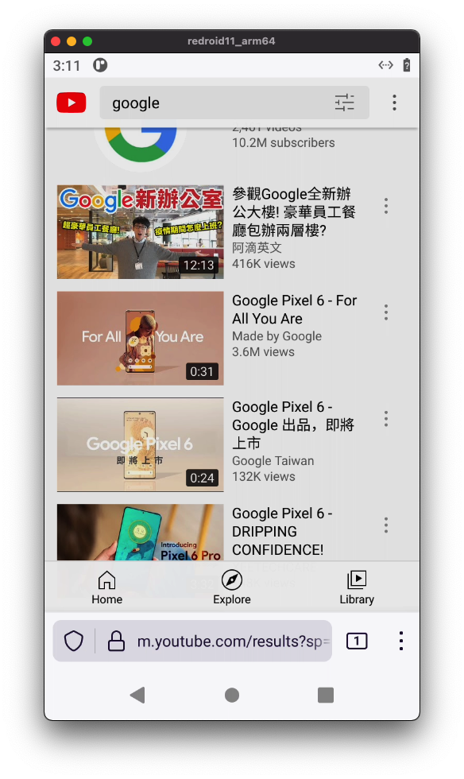

English | [简体中文](README.zh-cn.md)

# Table of contents
- [Overview](#overview)
- [Getting Started](#getting-started)
- [Configuration](#configuration)
- [Native Bridge Support](#native-bridge-support)
- [GMS Support](#gms-support)
- [WebRTC Streaming](#webrtc-streaming)
- [How To Build](#how-to-build)
- [Troubleshooting](#troubleshooting)
- [Note](#note)
- [Contact Me](#contact-me)
- [License](#license)

## Overview
**ReDroid** (*Re*mote an*Droid*) is a GPU accelerated AIC (Android In Container) solution. You can boot many
instances in Linux host (`Docker`, `podman`, `k8s` etc.). *ReDroid* supports both `arm64` and `amd64` architectures. 
*ReDroid* is suitable for Cloud Gaming, VMI (Virtual Mobile Infrastructure), Automation Test and more.



Currently supported:
- Android 13 Preview (`redroid/redroid:13.0.0-latest`, `redroid/redroid:13.0.0-amd64`, `redroid/redroid:13.0.0-arm64`)
- Android 12 (`redroid/redroid:12.0.0-latest`, `redroid/redroid:12.0.0-amd64`, `redroid/redroid:12.0.0-arm64`)
- Android 12 64bit only (`redroid/redroid:12.0.0_64only-latest`, `redroid/redroid:12.0.0_64only-amd64`, `redroid/redroid:12.0.0_64only-arm64`)
- Android 11 (`redroid/redroid:11.0.0-latest`, `redroid/redroid:11.0.0-amd64`, `redroid/redroid:11.0.0-arm64`)
- Android 10 (`redroid/redroid:10.0.0-latest`, `redroid/redroid:10.0.0-amd64`, `redroid/redroid:10.0.0-arm64`)
- Android 9 (`redroid/redroid:9.0.0-latest`, `redroid/redroid:9.0.0-amd64`, `redroid/redroid:9.0.0-arm64`)
- Android 8.1 (`redroid/redroid:8.1.0-latest`, `redroid/redroid:8.1.0-amd64`, `redroid/redroid:8.1.0-arm64`)

Tested Platforms:
- Ubuntu 16.04 / 18.04 / 20.04 (amd64 / arm64)
- Amazon Linux 2 (amd64 / arm64)
- Alibaba Cloud Linux 2 (amd64)
- Alibaba Cloud Linux 3 (amd64 / arm64)
- WSL 2 (Ubuntu) (amd64)
- CentOS (amd64\*, arm64\*)
- OpenEuler 20.03 (amd64, arm64\*)

\* customized kernel required

## Getting Started
*ReDroid* requires some kernel modules (`binderfs`, `ashmem` etc.).
**Check [kernel modules](https://github.com/remote-android/redroid-modules) to install these modules.**

```bash
# start and connect via `scrcpy`
docker run -itd --rm --memory-swappiness=0 --privileged \
    --pull always \
    -v ~/data:/data \
    -p 5555:5555 \
    redroid/redroid:11.0.0-latest

adb connect <IP>:5555
scrcpy --serial <IP>:5555

## Explanation:
##   --pull always    -- be sure to use the latest image
##   -v ~/data:/data  -- mount data partition
##   -p 5555:5555     -- expose adb port, you can connect via `adb connect <HOST-IP>`

```

## Configuration
required params (already added in docker image)
- qemu=1
- androidboot.hardware=redroid

display params
- redroid.width=720
- redroid.height=1280
- redroid.fps=15
- ro.sf.lcd_density=320

Network:
- net.eth0.dns1=<IP>
- net.eth0.proxy.type=[static|pac|none|unassigned]
- net.eth0.proxy.host=<IP>
- net.eth0.proxy.port=<port>

GPU accelerating
*ReDroid* use mesa3d to accelerate 3D rendering.
Currently tested platforms:
- AMD (arm64, amd64 with `amdgpu` driver)
- Intel (amd64 with `i915` driver)
- virtio-gpu (vendor agnostic, arm64 and amd64)

params:
- redroid.gpu.mode=[auto|host|guest]
- redroid.gpu.node=[/dev/dri/renderDxxx]

NOTE: you can override system props prefixed with `qemu.` or `ro.`. for example, you can set `ro.secure=0`, then 
you can get root adb shell by default.

## Native Bridge Support
It's possible to run `arm` Apps in `x86` *ReDroid* instance via `libhoudini`, `libndk_translator` or `QEMU translator`.

Take `libndk_translator` as an example:

``` bash
# grab libndk_translator libs from Android 11 Emulator
find /system \( -name 'libndk_translation*' -o -name '*arm*' -o -name 'ndk_translation*' \) | tar -cf native-bridge.tar -T -

# example structure, be careful the file owner and mode

system/
├── bin
│   ├── arm
│   └── arm64
├── etc
│   ├── binfmt_misc
│   └── init
├── lib
│   ├── arm
│   └── libnb.so
└── lib64
    ├── arm64
    └── libnb.so
```

```dockerfile
# Dockerfile
FROM redroid/redroid:11.0.0-amd64

ADD native-bridge.tar /

COPY factory.prop /factory/factory.prop
```

```
# factory.prop
ro.product.cpu.abilist=x86_64,arm64-v8a,x86,armeabi-v7a,armeabi
ro.product.cpu.abilist64=x86_64,arm64-v8a
ro.product.cpu.abilist32=x86,armeabi-v7a,armeabi
ro.dalvik.vm.isa.arm=x86
ro.dalvik.vm.isa.arm64=x86_64
ro.enable.native.bridge.exec=1
ro.dalvik.vm.native.bridge=libndk_translation.so
ro.ndk_translation.version=0.2.2
```

```bash
# build docker image
docker build . -t redroid:11.0.0-amd64-nb
```

Take a look at https://gitlab.com/android-generic/android_vendor_google_emu-x86 to extract automatically libndk_translator from the Android 11 emulator images. 

After following the guide on "Building" section, you will get native-bridge.tar under vendor/google/emu-x86/proprietary.

If you find errors in using libndk_translator, please try the following:

- YOU MUST HAVE binfmt_misc kernel module loaded for supporting other binaries formats! If you have not loaded it already:

  ```bash
  sudo modprobe binfmt_misc
  ```

  or add binfmt_misc to /etc/modules to autoload it at boot (for example in Ubuntu). 

  Check your specific distribution wiki/docs if you don't have binfmt_misc module and you want to install it, or how to autoload the module at boot.

- Extract the native bridge archive, preserving the permissions, set specific permissions for allowing init file to be executed and traverse of important dirs:

  ```bash
  mkdir native-bridge
  cd native-bridge
  sudo tar -xpf ../native-bridge.tar `#or path to your actual native bridge tarball`
  sudo chmod 0644 system/etc/init/ndk_translation_arm64.rc
  sudo chmod 0755 system/bin/arm
  sudo chmod 0755 system/bin/arm64
  sudo chmod 0755 system/lib/arm
  sudo chmod 0755 system/lib64/arm64
  sudo chmod 0644 system/etc/binfmt_misc/*
  sudo tar -cpf native-bridge.tar system
  ```

  Move or copy your new native-bridge.tar into the dir where you have written your Dockerfile, and rebuild again the new image with native bridge support. 
  
  You must use sudo or a root shell to preserve the permissions and owners of the files.

## GMS Support

It's possible to add GMS (Google Mobile Service) support in *ReDroid* via [Open GApps](https://opengapps.org/), [MicroG](https://microg.org/) or [MindTheGapps](https://gitlab.com/MindTheGapps/vendor_gapps).


## WebRTC Streaming
**CALL FOR HELP**

Plan to port `WebRTC` solutions from `cuttlefish`, including frontend (HTML5), backend and many virtual HALs.

## How To Build
It's Same as AOSP building process. But I suggest to use `docker` to build.

Check [android-builder-docker](./android-builder-docker) for details.

## Troubleshooting
- Container disappeared immediately
> make sure the required kernel modules are installed; run `dmesg -T` for detailed logs

- Container running, but adb cannot connect (device offline etc.)
> run `docker exec -it <container> sh`, then check `ps -A` and `logcat`
>
> try `dmesg -T` if cannot get a container shell


## Note
- Kernel 5.7+, need enable `binderfs` / `ashmem`
- `redroid` require `pid_max` less than 65535, or else may run into problems. Change in host OS, or add `pid_max` separation support in PID namespace
- SElinux is disabled in *ReDroid*; possible enabled with [selinuxns POC](http://namei.org/presentations/selinux_namespacing_lca2018.pdf)
- `sdcardfs` currently not implemented, use `fuse` instead; may need run `modprobe fuse` first in some OS (AmazonLinux2 ?)
- CGroups errors ignored; some (`stune` for example) not supported in generic linux.
- `procfs` not fully seperated with host OS; Community use `lxcfs` and some cloud vendor ([TencentOS](https://github.com/Tencent/TencentOS-kernel)) enhanced in their own kernel.
- vintf verify disabled (since no kernel)

## Contact Me
- ziyang.zhou@outlook.com
- remote-android.slack.com (invite link: https://join.slack.com/t/remote-android/shared_invite/zt-q40byk2o-YHUgWXmNIUC1nweQj0L9gA)

## License
*ReDroid* itself is under [Apache License](https://www.apache.org/licenses/LICENSE-2.0), since *ReDroid* includes 
many 3rd party modules, you may need to examine license carefully.

*ReDroid* kernel modules are under [GPL v2](https://www.gnu.org/licenses/old-licenses/gpl-2.0.en.html)

