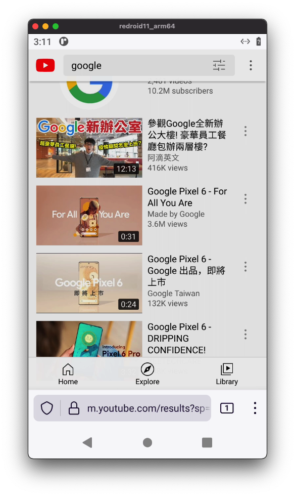

[English](README.md) | 简体中文

# 目录
- [概述](#概述)
- [快速开始](#快速开始)
- [配置](#配置)
- [原生桥接支持](#原生桥接支持)
- [GMS支持](#gms支持)
- [WebRTC流媒体](#webrtc流媒体)
- [如何构建](#如何构建)
- [故障排查](#故障排查)
- [联系我](#联系我)
- [许可证](#许可证)

## 概述
*redroid*（*Re*mote an*Droid*）是一个GPU加速的AIC（Android In Cloud）解决方案。您可以在Linux主机（`Docker`、`podman`、`k8s`等）中启动多个实例。*redroid*支持`arm64`和`amd64`架构。
*redroid*适用于云游戏、虚拟手机、自动化测试等场景。



当前支持版本：
- Android 16（`redroid/redroid:16.0.0-latest`）
- Android 16 仅64位（`redroid/redroid:16.0.0_64only-latest`）
- Android 15（`redroid/redroid:15.0.0-latest`）
- Android 15 仅64位（`redroid/redroid:15.0.0_64only-latest`）
- Android 14（`redroid/redroid:14.0.0-latest`）
- Android 14 仅64位（`redroid/redroid:14.0.0_64only-latest`）
- Android 13（`redroid/redroid:13.0.0-latest`）
- Android 13 仅64位（`redroid/redroid:13.0.0_64only-latest`）
- Android 12（`redroid/redroid:12.0.0-latest`）
- Android 12 仅64位（`redroid/redroid:12.0.0_64only-latest`）
- Android 11（`redroid/redroid:11.0.0-latest`）
- Android 10（`redroid/redroid:10.0.0-latest`）
- Android 9（`redroid/redroid:9.0.0-latest`）
- Android 8.1（`redroid/redroid:8.1.0-latest`）

## 快速开始
*redroid*应该能够在任何Linux发行版上运行（需要启用某些内核特性）。

这里以*Ubuntu 20.04*为例进行快速开始；其他发行版请查看[部署章节](deploy/README.md)。

```bash
## 安装docker https://docs.docker.com/engine/install/#server

## 安装必需的内核模块
apt install linux-modules-extra-`uname -r`
modprobe binder_linux devices="binder,hwbinder,vndbinder"
modprobe ashmem_linux


## 运行redroid
docker run -itd --rm --privileged \
    --pull always \
    -v ~/data:/data \
    -p 5555:5555 \
    redroid/redroid:12.0.0_64only-latest

### 参数说明：
###   --pull always    -- 使用最新镜像
###   -v ~/data:/data  -- 挂载data分区
###   -p 5555:5555     -- 暴露adb端口

### 免责声明
### 不应在公共网络上暴露adb端口
### 否则，redroid容器（甚至主机操作系统）可能会被入侵

## 安装adb https://developer.android.com/studio#downloads
adb connect localhost:5555
### 注意：如果远程运行redroid，请将localhost更改为IP

## 查看redroid屏幕
## 安装scrcpy https://github.com/Genymobile/scrcpy/blob/master/README.md#get-the-app
scrcpy -s localhost:5555
### 注意：如果远程运行redroid，请将localhost更改为IP
###     通常在本地PC上运行scrcpy
```

## 配置

```
## 使用自定义设置运行redroid（例如自定义显示）
docker run -itd --rm --privileged \
    --pull always \
    -v ~/data:/data \
    -p 5555:5555 \
    redroid/redroid:12.0.0_64only-latest \
    androidboot.redroid_width=1080 \
    androidboot.redroid_height=1920 \
    androidboot.redroid_dpi=480 \
```

| 参数 | 描述 | 默认值 |
| --- | --- | --- |
| `androidboot.redroid_width` | 显示宽度 | 720 |
| `androidboot.redroid_height` | 显示高度 | 1280 |
| `androidboot.redroid_fps` | 显示FPS | 30（启用GPU）<br> 15（未启用GPU）|
| `androidboot.redroid_dpi` | 显示DPI | 320 |
| `androidboot.use_memfd` | 使用`memfd`替换已弃用的`ashmem`<br>计划默认启用 | false |
| `androidboot.use_redroid_overlayfs` | 使用`overlayfs`共享`data`分区<br>`/data-base`：共享`data`分区<br>`/data-diff`：私有数据 | 0 |
| `androidboot.redroid_net_ndns` | DNS服务器数量，如果未指定DNS服务器将使用`8.8.8.8` | 0 |
| `androidboot.redroid_net_dns<1..N>` | DNS | |
| `androidboot.redroid_net_proxy_type` | 代理类型；可选：`static`、`pac`、`none`、`unassigned` | |
| `androidboot.redroid_net_proxy_host` | | |
| `androidboot.redroid_net_proxy_port` | | 3128 |
| `androidboot.redroid_net_proxy_exclude_list` | 逗号分隔的列表 | |
| `androidboot.redroid_net_proxy_pac` | | |
| `androidboot.redroid_gpu_mode` | 可选：`auto`、`host`、`guest`；<br>`guest`：使用软件渲染；<br>`host`：使用GPU加速渲染；<br>`auto`：自动检测 | `guest` |
| `androidboot.redroid_gpu_node` | | 自动检测 |
| `ro.xxx`| **调试**用途，允许覆盖`ro.xxx`属性；例如，设置`ro.secure=0`，则默认提供root adb shell | |

## 原生桥接支持
可以通过`libhoudini`、`libndk_translation`或`QEMU translator`在`x86` *redroid*实例中运行`arm`应用。

查看[@zhouziyang/libndk_translation](https://github.com/zhouziyang/libndk_translation)获取预构建的`libndk_translation`。
已发布的*redroid*镜像已包含`libndk_translation`。

``` bash
# 示例结构，注意文件所有者和权限

system/
├── bin
│   ├── arm
│   └── arm64
├── etc
│   ├── binfmt_misc
│   └── init
├── lib
│   ├── arm
│   └── libnb.so
└── lib64
    ├── arm64
    └── libnb.so
```

```dockerfile
# Dockerfile
FROM redroid/redroid:11.0.0-latest

ADD native-bridge.tar /
```

```bash
# 构建docker镜像
docker build . -t redroid:11.0.0-nb

# 运行
docker run -itd --rm --privileged \
    -v ~/data11-nb:/data \
    -p 5555:5555 \
    redroid:11.0.0-nb \
```

## GMS支持

可以通过[Open GApps](https://opengapps.org/)、[MicroG](https://microg.org/)或[MindTheGapps](https://gitlab.com/MindTheGapps/vendor_gapps)在*redroid*中添加GMS（Google移动服务）支持。

详情请查看[android-builder-docker](./android-builder-docker)。

## WebRTC流媒体
计划从`cuttlefish`移植`WebRTC`解决方案，包括前端（HTML5）、后端和许多虚拟HAL。

## 如何构建
构建过程与AOSP相同，但我建议使用`docker`进行构建。

详情请查看[android-builder-docker](./android-builder-docker)。

使用清华大学AOSP镜像源：
- https://mirrors.tuna.tsinghua.edu.cn/help/AOSP/
- `export REPO_URL=https://github.com/aosp-mirror/tools_repo.git`

## 故障排查
- 如何收集调试信息
> `curl -fsSL https://raw.githubusercontent.com/remote-android/redroid-doc/master/debug.sh | sudo bash -s -- [CONTAINER]`
>
> 如果容器已不存在，可省略*CONTAINER*

- 容器立即消失
> 确保已安装必需的内核模块；运行`dmesg -T`查看详细日志

- 容器运行，但adb无法连接（设备离线等）
> 运行`docker exec -it <container> sh`，然后检查`ps -A`和`logcat`
>
> 如果无法获取容器shell，尝试`dmesg -T`

## 联系我
- remote-android.slack.com（邀请链接：https://join.slack.com/t/remote-android/shared_invite/zt-387g26jdj-5kyINRegb_9BtYALktKtbA）
- ziyang.zhou@outlook.com

## 许可证
*redroid*本身采用[Apache许可证](https://www.apache.org/licenses/LICENSE-2.0)，由于*redroid*包含许多第三方模块，您可能需要仔细检查许可证。

*redroid*内核模块采用[GPL v2](https://www.gnu.org/licenses/old-licenses/gpl-2.0.en.html)许可证
