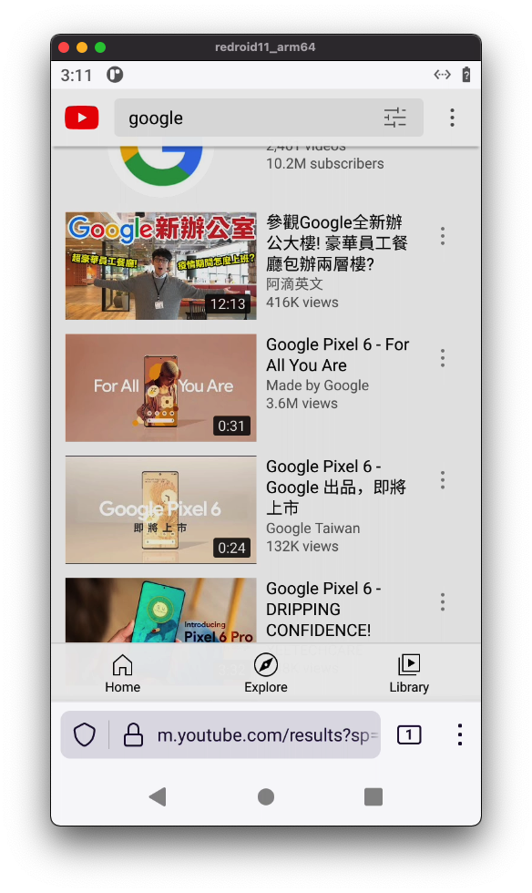

English(README.md) | 简体中文

# 目录
- [概述](#概述)
- [入门](#入门)
- [配置](#配置)
- [本地网桥](#本地网桥)
- [谷歌消息服务GMS](#谷歌消息服务GMS)
- [WebRTC流失传输](#webrtc流式传输)
- [构建教程](#构建教程)
- [疑难解答](#疑难解答)
- [联系我](#联系我)
- [许可证](#开源许可证)


## 概述
*Redroid* (*Re*mote an*Droid*) 是一个GPU加速的AIC (Android In Cloud) 解决方案.
您可以在Linux主机中启动许多实例(`Docker`, `podman`, `k8s` 等等).
*Redroid* 同时支持 `arm64`和`amd64` 架构的CPU平台. 
*Redroid* 适用于云手机、虚拟手机、自动化测试等。



当前已支持的Android版本:
- Android 14 (`redroid/redroid:14.0.0-latest`)
- Android 14 64bit only (`redroid/redroid:14.0.0_64only-latest`)
- Android 13 (`redroid/redroid:13.0.0-latest`)
- Android 13 64bit only (`redroid/redroid:13.0.0_64only-latest`)
- Android 12 (`redroid/redroid:12.0.0-latest`)
- Android 12 64bit only (`redroid/redroid:12.0.0_64only-latest`)
- Android 11 (`redroid/redroid:11.0.0-latest`)
- Android 10 (`redroid/redroid:10.0.0-latest`)
- Android 9 (`redroid/redroid:9.0.0-latest`)
- Android 8.1 (`redroid/redroid:8.1.0-latest`)


## 入门
*Redroid* 应该能够在任何linux上运行(启用了一些内核功能)。

在此处快速启动*Ubuntu 20.04*；检查其他发行版的[deploy section](deploy/README.md)。

```bash
## 安装Docker https://docs.docker.com/engine/install/#server

## 安装需要的内核模块
apt install linux-modules-extra-`uname -r`
modprobe binder_linux devices="binder,hwbinder,vndbinder"
modprobe ashmem_linux


## 允许Redroid
docker run -itd --rm --privileged \
    --pull always \
    -v ~/data:/data \
    -p 5555:5555 \
    redroid/redroid:11.0.0-latest

### 解释:
###   --pull always    -- 使用最新的镜像
###   -v ~/data:/data  -- 挂载Data分区
###   -p 5555:5555     -- 使ADB远程端口暴露在宿主机中, 如果在宿主机上启动多个实例, 请修改前面的5555


## 安装ADB https://developer.android.com/studio#downloads
adb connect localhost:5555
### 注意: 如果要连接到远程Redroid, 请将localhost:5555修改为实际的IP:端口号

## 查看Redroid屏幕
## 安装Scrcpy https://github.com/Genymobile/scrcpy/blob/master/README.md#get-the-app
scrcpy -s localhost:5555
### 注意: 如果要连接到远程Redroid, 请将localhost:5555修改为实际的IP:端口号
###     通常在本地运行scrcpy
```

## 配置

```
## 使用自定义设置运行Redroid(这是一个自定义显示的示例)
docker run -itd --rm --privileged \
    --pull always \
    -v ~/data:/data \
    -p 5555:5555 \
    redroid/redroid:11.0.0-latest \
    androidboot.redroid_width=1080 \
    androidboot.redroid_height=1920 \
    androidboot.redroid_dpi=480 \
```

| 参数 | 描述 | 默认值 |
| --- | --- | --- |
| `androidboot.redroid_width` | 屏幕宽度 | 720 |
| `androidboot.redroid_height` | 屏幕高度 | 1280 |
| `androidboot.redroid_fps` | 屏幕FPS | 30(GPU enabled)<br> 15 (GPU not enabled)|
| `androidboot.redroid_dpi` | 屏幕DPI | 320 |
| `androidboot.use_memfd` | 使用`memfd`替换不推荐使用的`ashmem`<br>计划默认启用 | false |
| `androidboot.use_redroid_overlayfs` | 使用`overlayfs`来共享`data`分区<br>`/data-base`: 共享`data`分区<br>`/data-diff`:内部数据(私有) | 0 |
| `androidboot.redroid_net_ndns` | 如果没有指定DNS服务器, 将使用8.8.8.8 | 0 |
| `androidboot.redroid_net_dns<1..N>` | DNS | |
| `androidboot.redroid_net_proxy_type` | 代理类型; 从`static`, `pac`, `none`, `unassigned`之间选择一个 | |
| `androidboot.redroid_net_proxy_host` | 代理服务器地址 | |
| `androidboot.redroid_net_proxy_port` | 代理服务器端口号 | 3128 |
| `androidboot.redroid_net_proxy_exclude_list` | 代理服务器分隔列表, 使用逗号 | |
| `androidboot.redroid_net_proxy_pac` | 代理服务器PAC地址 | |
| `androidboot.redroid_gpu_mode` | GPU模式, 从`auto`, `host`, `guest`之间选择一个;<br>`guest`: 使用软件渲染器;<br>`host`: 使用GPU加速渲染;<br>`auto`: 自动检测 | `auto` |
| `androidboot.redroid_gpu_node` | | auto-detect |
| `ro.xxx`| **调试:** 目的是允许重写`ro.xxx`属性, 例如: `ro.secure=0`,然后通过ADB进入Shell并使用Root(默认情况下提供) | |


## 本地网桥
可以在`x86`中运行`arm`应用程序, *Redroid*实例通过`libhoudini`, `libndk_translation`或者`QEMU translator`.

检查[@zhouziyang/libndk_translation](https://github.com/zhouziyang/libndk_translation) 用于预构建`libndk_translation`.<br>
已发布的`Redroid`镜像已经包括了`libndk_translation`.

``` bash
# 示例结构, 注意文件所有者和模式

system/
├── bin
│   ├── arm
│   └── arm64
├── etc
│   ├── binfmt_misc
│   └── init
├── lib
│   ├── arm
│   └── libnb.so
└── lib64
    ├── arm64
    └── libnb.so
```

```dockerfile
# Dockerfile
FROM redroid/redroid:11.0.0-latest

ADD native-bridge.tar /
```

```bash
# 编译Docker敬昕
docker build . -t redroid:11.0.0-nb

# 运行Redroid
docker run -itd --rm --privileged \
    -v ~/data11-nb:/data \
    -p 5555:5555 \
    redroid:11.0.0-nb \
```

## 谷歌消息服务GMS
可以通过 [Open GApps](https://opengapps.org/), [MicroG](https://microg.org/)或[MindTheGapps](https://gitlab.com/mindthegapps/vendor_gapps) 在*Redroid*中添加GMS(谷歌移动服务)支持。

查看[android-builder-docker](./android-builder-docker)了解详情。

## WebRTC流失传输
计划将cuttlefish中的WebRTC解决方案进行移植，包括前端(HTML5)、后端和多个虚拟硬件抽象层(HALs)。

## 构建教程
这与AOSP构建过程类似， 但我建议使用`docker`进行构建。

查看[android-builder-docker](./android-builder-docker)了解详情。

## 疑难解答
- 如何收集调试二进制数据？
> `curl -fsSL https://raw.githubusercontent.com/remote-android/redroid-doc/master/debug.sh | sudo bash -s -- [CONTAINER]`
>
> 忽略*CONTAINER*, 如果不再存在

- 容器马上就消失了？
> 确保安装了所需的内核模块；运行`dmesg -T`以获取详细日志

- 容器运行中, 但是无法连接ADB(Device Offline)
> 执行`docker exec -it <container> sh`, 然后检查`ps -A`并`logcat`
>
> 如果不能获得一个容器的Shell, 请尝试执行`dmesg -T`

## 联系我
- remote-android.slack.com (邀请链接: https://join.slack.com/t/remote-android/shared_invite/zt-q40byk2o-YHUgWXmNIUC1nweQj0L9gA)
- ziyang.zhou@outlook.com

## 开源许可证
*Redroid*本身受到[Apache License](https://www.apache.org/licenses/LICENSE-2.0)的保护, 这是因为*Redroid*包括许多第三方模块，您可能需要仔细地检查许可证。

*Redroid*的内核受到[GPL v2](https://www.gnu.org/licenses/old-licenses/gpl-2.0.en.html)的保护

